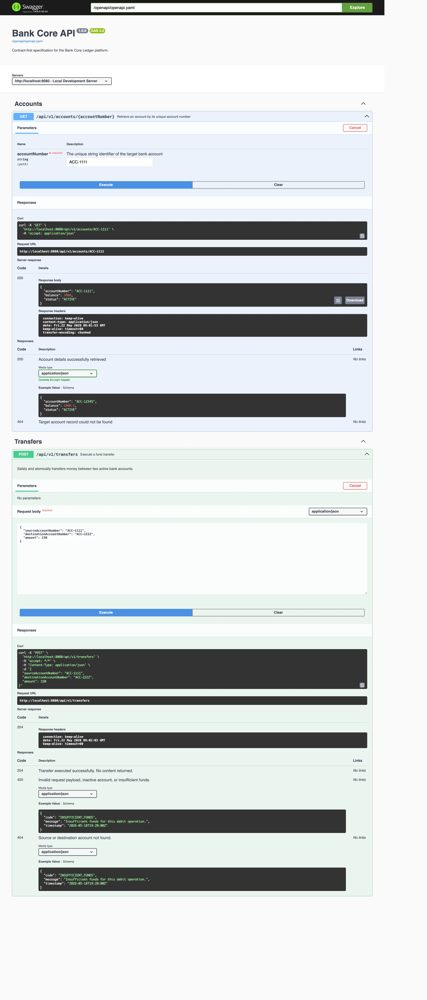

# Bank Core (`bank-core`)

A hands-on Spring Boot coding exercise designed to explore concurrent data modifications, database locking strategies, and AI assisted coding.

The primary goal of this project is to implement a fund transfer process between accounts and experiment with keeping an immutable accounting log (ledger) synchronized with balance snapshots without
overloading application memory.

> This was built with the help of AI - I used Google Gemini in the web browser and prompted it as I went. The code reflects the default style Gemini used, without any skills or training. While this
> served its purpose (refamiliarising myself with java and springboot after being in the Kotlin and Ktor ecosystem for a while) I think I can take a lot of inspiration from
> this post ["Make the Domain Explicit: From Procedural Mess to Local Reasoning"](https://adamtornhill.substack.com/p/make-the-domain-explicit-from-procedural) and refactor it -
> testing out various skills and code harnesses to see how well they work and to provide a comparison of the code styles. So, time permitting I will create branches for different experiments and
> comparison.

---

## 🛠️ Core Architectural Patterns

This project focuses on balancing the trade-offs between application throughput, code simplicity, and data consistency.

### 1. Simple Contract-First Generation

* **The Setup:** The public API contract is defined inside `src/main/resources/static/openapi/`. A Gradle plugin automatically scaffolds the underlying Spring MVC interface (`TransfersApi`) and
  request
  DTOs (`TransferRequest`) during the build lifecycle.
* **The Goal:** Separating the network layer from internal code structures and ensuring the contract remains the single source of truth.

### 2. Rich Domain vs. Anemic Models

* **The Setup:** Business logic, state changes, and prerequisite checks are handled entirely inside the `Account` and `JournalEntry` entity objects. There are no public setters.
* **The Goal:** Ensuring state mutations (`debit()`, `credit()`) can never be executed arbitrarily without passing core domain rules.

### 3. Deadlock-Free Pessimistic Locking

* **The Setup:** To transfer funds, the system acquires a database-level row lock (`SELECT FOR UPDATE`). Before making the repository query, the code sorts the source and destination account numbers
  alphabetically.
* **The Goal:** Forcing a strict, linear lock-acquisition order. This ensures that concurrent threads executing transfers back and forth between the same hot accounts queue up orderly rather than
  causing a cyclic deadlock.

---

## 💾 Unified Database-Level Ledger Validation

Instead of scattering mathematical calculations across different application layers or downloading large historical collections into Java JVM memory to verify if a journal is balanced, this project
utilizes a **Unified Database-Level Check Query**.

A single native SQL query handles the arithmetic directly inside the database engine layer:

```sql
SELECT CASE
           WHEN SUM(CASE WHEN type = 'CREDIT' THEN amount ELSE -amount END) = 0
               THEN 1
           ELSE 0 END
FROM ledger_transactions
WHERE journal_entry_id = :journalId

```

This $O(1)$ computation pass returns `1` if total debits perfectly equal total credits, and `0` if a drift exists. It completely eliminates lazy-loading proxy overhead and shields the application
layer from memory resource fatigue.

---

## ⏱️ Background Audit Schedulers

Two Spring `@Scheduled` components continuously police the ledger and account balances at runtime, providing defence-in-depth against bugs, partial writes, or concurrency races that might slip past
the synchronous transfer path.

### `LedgerReconciliationScheduler`

* **Cadence:** runs every 10 seconds (`fixedDelay = 10000`).
* **What it does:** pulls a small page (up to 50) of `JournalEntry` rows still in `PENDING` status and hands each one to `LedgerAuditorService.verifyJournal(...)`, which applies the unified
  database-level debit/credit balance check described above. Balanced journals are promoted to a verified terminal status; drifted journals are flagged for investigation.
* **Why it exists:** transfers may persist a journal optimistically before the ledger lines are guaranteed to sum to zero (e.g. multi-step posting, batch strategies). This sweep guarantees that every
  `PENDING` journal is eventually reconciled even if the originating request thread died or was rolled back mid-flight.

### `BalanceDriftDetectorScheduler`

* **Cadence:** runs every 30 seconds (`fixedDelay = 30000`).
* **What it does:** performs a **deterministic range-locked audit** of account balances against the immutable ledger (checks only those accounts with new transactions).
    1. Reads the persisted checkpoint (`SystemConfig.lastBalanceCheckId`) — the highest ledger transaction ID already audited.
    2. Captures the current `MAX(transaction_id)` as a ceiling marker.
    3. Runs a single SQL query that finds any account whose stored balance no longer matches the sum of its ledger transactions in that `(floor, ceiling]` segment.
    4. Suspends any drifted account (the clearing account is excluded) so it can no longer transact until a human investigates.
    5. Advances the checkpoint to the captured ceiling — transactions committed *after* the ceiling was captured naturally roll into the next sweep.
* **Why it exists:** the account `balance` column is a cached snapshot; the ledger is the source of truth. If the two ever disagree, the safest action is to freeze the account immediately rather than
  allow further compounding drift. The range-locked design avoids race conditions with live transfers — we never compare against a moving target.

---

## 🔧 Project Layout Notes

### Why We Didn't Use Ports & Adapters (Hexagonal Architecture)

Hexagonal Architecture is great for decoupling business rules from specific framework dependencies or database drivers. Because this project was written strictly as a localized coding exercise and an
experience-building sandbox done for fun, we skipped full port/adapter abstractions.

Instead, we relied on standard layered Spring Boot conventions combined with a rich domain layout. This minimized boilerplate overhead while keeping our focus directly on transaction locks,
multi-threaded testing, and Hibernate session management.

### Local Development Setup

To run the application locally using an in-memory **H2 Database** with data-seeding activated, run:

```bash
# Compile and generate OpenAPI interfaces
./gradlew openApiGenerate compileJava

# Boot the app with a specific ledger lifecycle strategy
SEED_DATA=true ./gradlew bootRun

```

* **H2 UI Access:** `http://localhost:8080/h2-console`
* **JDBC URL:** `jdbc:h2:mem:bank_core_dev`

### Testing the Concurrency Mechanics

The test suite includes targeted integration slices for each architecture strategy, alongside a multi-threaded stress test that slams the transaction boundaries using a Java `CountDownLatch` and an
`ExecutorService`:

```bash
./gradlew test

```

Use `./run.sh swagger` to open the swagger UI:


